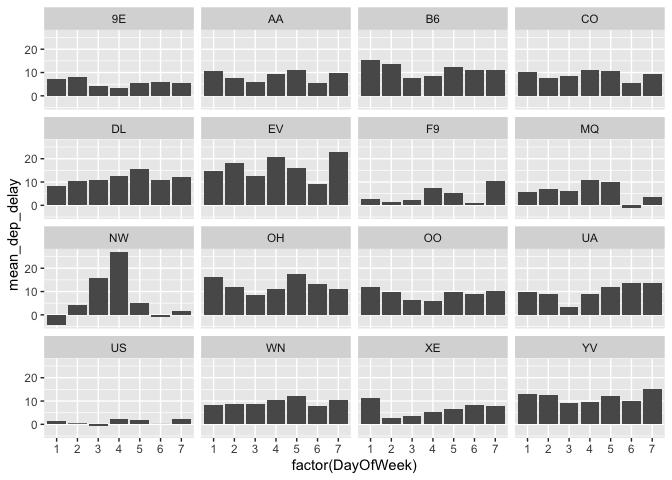
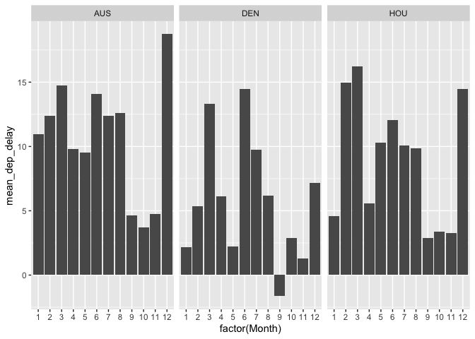
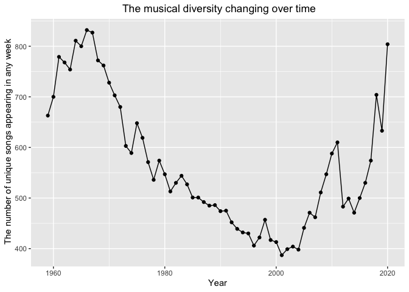
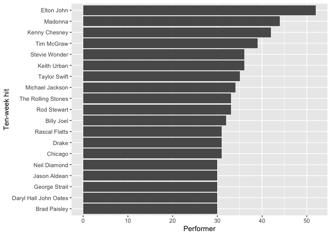
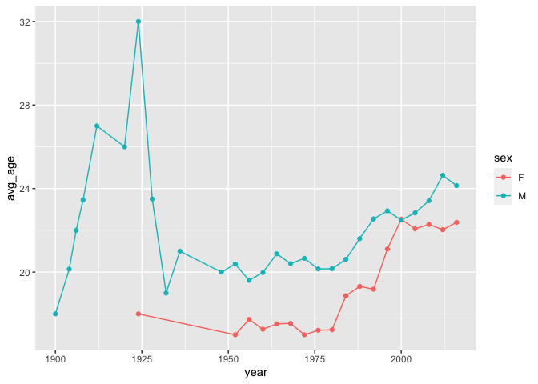
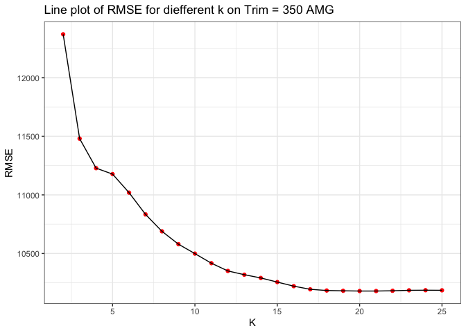
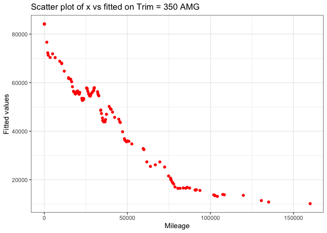
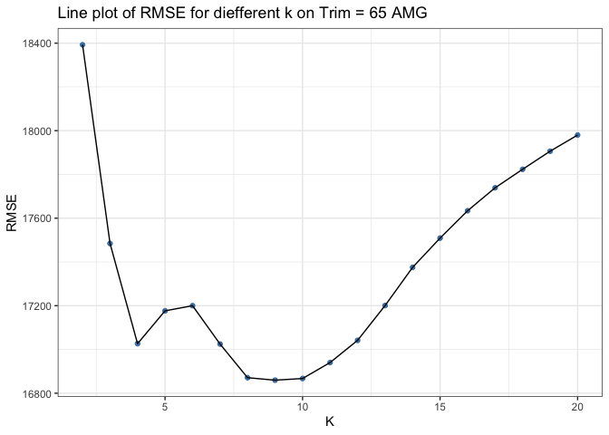
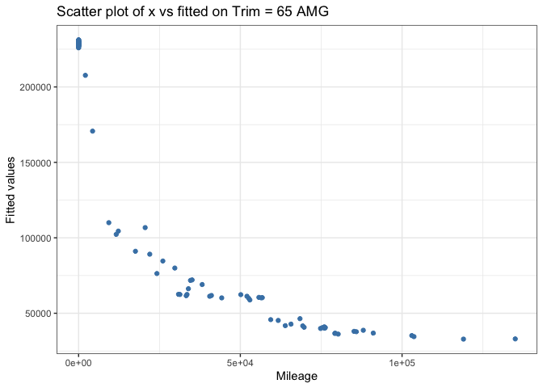

Author:

Shankai Liao

Xing Xin

Yiwen Wang

# Question 1

    ##       Year          Month         DayofMonth      DayOfWeek        DepTime    
    ##  Min.   :2008   Min.   : 1.00   Min.   : 1.00   Min.   :1.000   Min.   :   1  
    ##  1st Qu.:2008   1st Qu.: 3.00   1st Qu.: 8.00   1st Qu.:2.000   1st Qu.: 917  
    ##  Median :2008   Median : 6.00   Median :16.00   Median :4.000   Median :1329  
    ##  Mean   :2008   Mean   : 6.29   Mean   :15.73   Mean   :3.902   Mean   :1329  
    ##  3rd Qu.:2008   3rd Qu.: 9.00   3rd Qu.:23.00   3rd Qu.:6.000   3rd Qu.:1728  
    ##  Max.   :2008   Max.   :12.00   Max.   :31.00   Max.   :7.000   Max.   :2400  
    ##                                                                 NA's   :1413  
    ##    CRSDepTime      ArrTime       CRSArrTime   UniqueCarrier        FlightNum   
    ##  Min.   :  55   Min.   :   1   Min.   :   5   Length:99260       Min.   :   1  
    ##  1st Qu.: 915   1st Qu.:1107   1st Qu.:1115   Class :character   1st Qu.: 640  
    ##  Median :1320   Median :1531   Median :1535   Mode  :character   Median :1465  
    ##  Mean   :1320   Mean   :1487   Mean   :1505                      Mean   :1917  
    ##  3rd Qu.:1720   3rd Qu.:1903   3rd Qu.:1902                      3rd Qu.:2653  
    ##  Max.   :2346   Max.   :2400   Max.   :2400                      Max.   :9741  
    ##                 NA's   :1567                                                   
    ##    TailNum          ActualElapsedTime CRSElapsedTime     AirTime      
    ##  Length:99260       Min.   : 22.0     Min.   : 17.0   Min.   :  3.00  
    ##  Class :character   1st Qu.: 57.0     1st Qu.: 58.0   1st Qu.: 38.00  
    ##  Mode  :character   Median :125.0     Median :130.0   Median :105.00  
    ##                     Mean   :120.2     Mean   :122.1   Mean   : 99.81  
    ##                     3rd Qu.:164.0     3rd Qu.:165.0   3rd Qu.:142.00  
    ##                     Max.   :506.0     Max.   :320.0   Max.   :402.00  
    ##                     NA's   :1601      NA's   :11      NA's   :1601    
    ##     ArrDelay           DepDelay          Origin              Dest          
    ##  Min.   :-129.000   Min.   :-42.000   Length:99260       Length:99260      
    ##  1st Qu.:  -9.000   1st Qu.: -4.000   Class :character   Class :character  
    ##  Median :  -2.000   Median :  0.000   Mode  :character   Mode  :character  
    ##  Mean   :   7.065   Mean   :  9.171                                        
    ##  3rd Qu.:  10.000   3rd Qu.:  8.000                                        
    ##  Max.   : 948.000   Max.   :875.000                                        
    ##  NA's   :1601       NA's   :1413                                           
    ##     Distance        TaxiIn           TaxiOut         Cancelled      
    ##  Min.   :  66   Min.   :  0.000   Min.   :  1.00   Min.   :0.00000  
    ##  1st Qu.: 190   1st Qu.:  4.000   1st Qu.:  9.00   1st Qu.:0.00000  
    ##  Median : 775   Median :  5.000   Median : 12.00   Median :0.00000  
    ##  Mean   : 705   Mean   :  6.413   Mean   : 13.96   Mean   :0.01431  
    ##  3rd Qu.:1085   3rd Qu.:  7.000   3rd Qu.: 16.00   3rd Qu.:0.00000  
    ##  Max.   :1770   Max.   :143.000   Max.   :305.00   Max.   :1.00000  
    ##                 NA's   :1567      NA's   :1419                      
    ##  CancellationCode      Diverted         CarrierDelay     WeatherDelay   
    ##  Length:99260       Min.   :0.000000   Min.   :  0.00   Min.   :  0.00  
    ##  Class :character   1st Qu.:0.000000   1st Qu.:  0.00   1st Qu.:  0.00  
    ##  Mode  :character   Median :0.000000   Median :  0.00   Median :  0.00  
    ##                     Mean   :0.001824   Mean   : 15.39   Mean   :  2.24  
    ##                     3rd Qu.:0.000000   3rd Qu.: 16.00   3rd Qu.:  0.00  
    ##                     Max.   :1.000000   Max.   :875.00   Max.   :412.00  
    ##                                        NA's   :79513    NA's   :79513   
    ##     NASDelay      SecurityDelay    LateAircraftDelay
    ##  Min.   :  0.00   Min.   :  0.00   Min.   :  0.00   
    ##  1st Qu.:  0.00   1st Qu.:  0.00   1st Qu.:  0.00   
    ##  Median :  2.00   Median :  0.00   Median :  6.00   
    ##  Mean   : 12.47   Mean   :  0.07   Mean   : 22.97   
    ##  3rd Qu.: 16.00   3rd Qu.:  0.00   3rd Qu.: 30.00   
    ##  Max.   :367.00   Max.   :199.00   Max.   :458.00   
    ##  NA's   :79513    NA's   :79513    NA's   :79513

    ## # A tibble: 7 × 10
    ##   DayOfWeek   min    Q1 median    Q3   max  mean    sd     n missing
    ##       <int> <dbl> <dbl>  <dbl> <dbl> <dbl> <dbl> <dbl> <int>   <int>
    ## 1         1   -23    -4      0     8   442  9.76  32.1 14616     182
    ## 2         2   -42    -4     -1     6   665  8.46  31.7 14514     289
    ## 3         3   -21    -4     -1     5   372  7.25  27.6 14618     223
    ## 4         4   -36    -3      0     9   508  9.55  30.0 14557     217
    ## 5         5   -22    -3      0    11   483 11.3   32.3 14571     197
    ## 6         6   -29    -4     -1     6   875  7.47  30.6 11304     150
    ## 7         7   -25    -4      0     8   509 10.1   33.4 13667     155

In terms of the averages, delays are minimized on Wednesday and
Saturday. According to the standard deviation, Saturday is more “stable”

    ## # A tibble: 112 × 4
    ## # Groups:   DayOfWeek [7]
    ##    DayOfWeek UniqueCarrier count mean_dep_delay
    ##        <int> <chr>         <int>          <dbl>
    ##  1         1 9E              380           7.09
    ##  2         1 AA             2924          10.8 
    ##  3         1 B6              697          15.3 
    ##  4         1 CO             1439          10.1 
    ##  5         1 DL              333           8.43
    ##  6         1 EV              111          14.6 
    ##  7         1 F9              312           2.82
    ##  8         1 MQ              416           5.86
    ##  9         1 NW               13          -4.31
    ## 10         1 OH              442          16.4 
    ## # … with 102 more rows

The change of delays is related to airlines. “US” airline has the
minimized delays.

    ## # A tibble: 12 × 10
    ##    Month   min    Q1 median    Q3   max  mean    sd     n missing
    ##    <int> <dbl> <dbl>  <dbl> <dbl> <dbl> <dbl> <dbl> <int>   <int>
    ##  1     1   -29    -4     -1   8     345  8.37  29.1  8588     138
    ##  2     2   -22    -4      0  10     372 10.3   31.1  7985     171
    ##  3     3   -22    -3      0  14     437 13.3   35.9  8699     222
    ##  4     4   -22    -4     -1   7     412  8.17  29.8  8273     185
    ##  5     5   -36    -4      0   9     391  8.85  28.6  8906     115
    ##  6     6   -20    -3      0  11     405 12.2   34.4  8979     111
    ##  7     7   -42    -4      0   7     665 10.2   34.5  8841      90
    ##  8     8   -20    -4      0   8     508 10.3   34.2  8458      95
    ##  9     9   -20    -5     -2   1     272  3.33  20.4  7310     154
    ## 10    10   -17    -4     -2   3     442  3.88  21.8  7646      26
    ## 11    11   -26    -4     -2   2     344  4.36  22.6  6998      22
    ## 12    12   -16    -3      1  15.2   875 15.3   40.2  7164      84

In 2008, September and October are the best time to fly in terms to the
average.

    ## # A tibble: 36 × 4
    ## # Groups:   Month [12]
    ##    Month Dest  count mean_dep_delay
    ##    <int> <chr> <int>          <dbl>
    ##  1     1 AUS    1463          10.9 
    ##  2     1 DEN      67           2.17
    ##  3     1 HOU      75           4.61
    ##  4     2 AUS    1329          12.4 
    ##  5     2 DEN      67           5.37
    ##  6     2 HOU      53          14.9 
    ##  7     3 AUS    1509          14.8 
    ##  8     3 DEN      88          13.3 
    ##  9     3 HOU      69          16.2 
    ## 10     4 AUS    1386           9.78
    ## # … with 26 more rows

Through the plot, we could conclude that the less delay takes place in
the Denver international airport, but it is unstable. Specifically, in
March and June it can happen much more delay.

# Question 2

    ##   X                                                url   week_id week_position
    ## 1 1 http://www.billboard.com/charts/hot-100/1965-07-17 7/17/1965            34
    ## 2 2 http://www.billboard.com/charts/hot-100/1965-07-24 7/24/1965            22
    ## 3 3 http://www.billboard.com/charts/hot-100/1965-07-31 7/31/1965            14
    ## 4 4 http://www.billboard.com/charts/hot-100/1965-08-07  8/7/1965            10
    ## 5 5 http://www.billboard.com/charts/hot-100/1965-08-14 8/14/1965             8
    ## 6 6 http://www.billboard.com/charts/hot-100/1965-08-21 8/21/1965             8
    ##                     song  performer                          song_id instance
    ## 1 Don't Just Stand There Patty Duke Don't Just Stand TherePatty Duke        1
    ## 2 Don't Just Stand There Patty Duke Don't Just Stand TherePatty Duke        1
    ## 3 Don't Just Stand There Patty Duke Don't Just Stand TherePatty Duke        1
    ## 4 Don't Just Stand There Patty Duke Don't Just Stand TherePatty Duke        1
    ## 5 Don't Just Stand There Patty Duke Don't Just Stand TherePatty Duke        1
    ## 6 Don't Just Stand There Patty Duke Don't Just Stand TherePatty Duke        1
    ##   previous_week_position peak_position weeks_on_chart year week
    ## 1                     45            34              4 1965   29
    ## 2                     34            22              5 1965   30
    ## 3                     22            14              6 1965   31
    ## 4                     14            10              7 1965   32
    ## 5                     10             8              8 1965   33
    ## 6                      8             8              9 1965   34

## Part(A)

    ## # A tibble: 10 × 3
    ## # Groups:   performer [10]
    ##    performer                                 song_id                       count
    ##    <chr>                                     <chr>                         <int>
    ##  1 Imagine Dragons                           RadioactiveImagine Dragons       87
    ##  2 AWOLNATION                                SailAWOLNATION                   79
    ##  3 Jason Mraz                                I'm YoursJason Mraz              76
    ##  4 The Weeknd                                Blinding LightsThe Weeknd        76
    ##  5 LeAnn Rimes                               How Do I LiveLeAnn Rimes         69
    ##  6 LMFAO Featuring Lauren Bennett & GoonRock Party Rock AnthemLMFAO Featu…    68
    ##  7 OneRepublic                               Counting StarsOneRepublic        68
    ##  8 Adele                                     Rolling In The DeepAdele         65
    ##  9 Jewel                                     Foolish Games/You Were Meant…    65
    ## 10 Carrie Underwood                          Before He CheatsCarrie Under…    64

We concluded that the most popular song is “Radioactive”.

## Part(B)

    ## # A tibble: 62 × 2
    ##     year diversity
    ##    <int>     <int>
    ##  1  1959       663
    ##  2  1960       700
    ##  3  1961       779
    ##  4  1962       768
    ##  5  1963       754
    ##  6  1964       811
    ##  7  1965       800
    ##  8  1966       832
    ##  9  1967       827
    ## 10  1968       772
    ## # … with 52 more rows

## Part(C)

    ## # A tibble: 19 × 2
    ##    performer             times
    ##    <chr>                 <int>
    ##  1 Billy Joel               32
    ##  2 Brad Paisley             30
    ##  3 Chicago                  31
    ##  4 Daryl Hall John Oates    30
    ##  5 Drake                    31
    ##  6 Elton John               52
    ##  7 George Strait            30
    ##  8 Jason Aldean             30
    ##  9 Keith Urban              36
    ## 10 Kenny Chesney            42
    ## 11 Madonna                  44
    ## 12 Michael Jackson          34
    ## 13 Neil Diamond             30
    ## 14 Rascal Flatts            31
    ## 15 Rod Stewart              33
    ## 16 Stevie Wonder            36
    ## 17 Taylor Swift             35
    ## 18 The Rolling Stones       33
    ## 19 Tim McGraw               39

# Question 3

\#\#Part(A)

    ##   0%  95% 100% 
    ##  150  183  193

the 95th percentile of heights for female competitors across all
Athletics events is 183

\#\#Part(B)

    ## # A tibble: 1 × 3
    ##   event                          n sd_height
    ##   <chr>                      <int>     <dbl>
    ## 1 Rowing Women's Coxed Fours    63      10.9

The event had the greatest variability in competitor’s heights is Rowing
Women’s Coxed Fours

\#\#Part(C)

From the plot, the average age of swimmers changed a lot before 1950.
After that, the average age increased steadily and becomes stable
between 22-24. For male swimmers, it had a big change and even get 32 in
1924 but becomes stable after 1950. It increased around 24 recently. For
female swimmers, it’s a small number from 1924 and the average age
increased about 22 in 2020s.

# Question 4

### 1.Trim = 350 AMG

As K increases, the RMSE of the test set decreases gradually. When K≥18,
the RMSE remained basically unchanged. So the optimal K value is 18.

### 2.Trim = 65 AMG

As K increases, the RMSE of the test set first decreases and then
increases. When K=9, the RMSE value is the smallest. Therefore, the
optimal K value is 9.

350 AMG yields a larger optimal value of K. Because the 350 AMG level
has significantly more data than the 65 AMG level.
